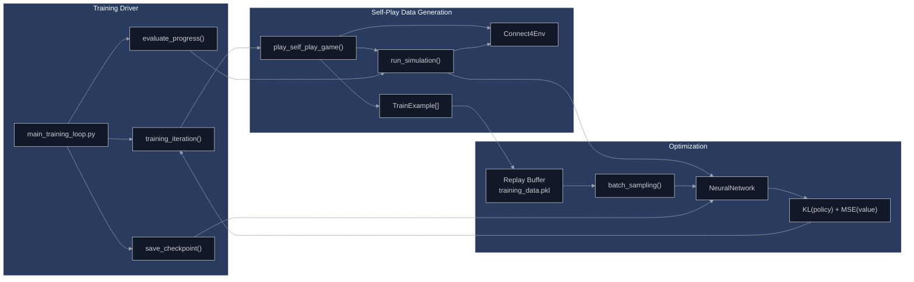
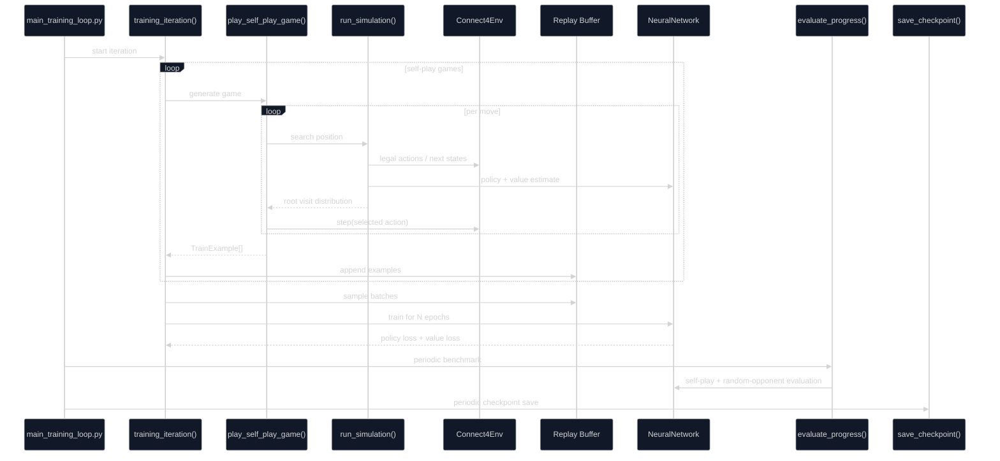
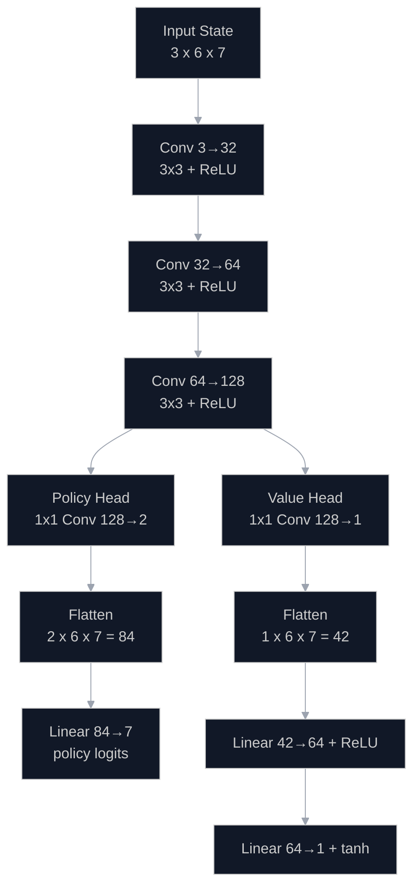
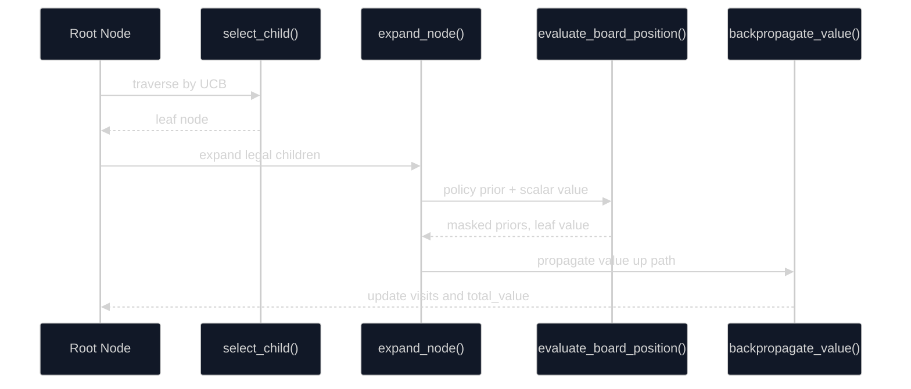
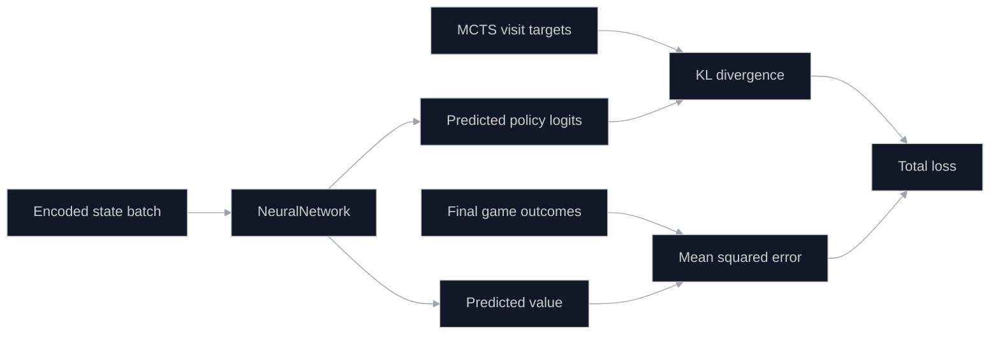

# Connect4 RL

A compact AlphaZero-style Connect 4 project built around self-play, Monte Carlo Tree Search (MCTS), and a dual-head convolutional neural network. The codebase trains a policy-value model from games it generates against itself, then evaluates progress with a lightweight project-specific score.

## Self-Play Screencast

Latest self-play recording:

- [Self-Play Screencast (.webm)](assets/screencasts/checkpoint_0500_latest_screencast_2026-05-18.webm)

[](https://huggingface.co/Pradheep1647/connect4_rl_self_play/tree/main/checkpoints)

## Overview

The repository is organized around five subsystems:

1. `game_engine_components/` implements board state management, move application, terminal detection, and tensor conversion.
2. `neural_network_components/` implements the shared convolutional trunk, the policy head, the value head, and the training loss.
3. `mcts_components/` implements tree node creation, selection, expansion, evaluation, and value backpropagation.
4. `training_data_components/` generates self-play games and converts them into policy/value supervision.
5. `training_loop_components/` runs iterative training, evaluation, checkpointing, and scheduler updates.

## System Architecture



### End-to-End Training Sequence



### Self-Play Loop

For each position, the agent runs MCTS, converts the visit counts at the root into a target move distribution, samples a move, and appends the position to the training set. When the game terminates, each stored position receives the final game outcome from the perspective of the player who acted in that state.

If the terminal game result is denoted by \(z \in \{-1, 0, 1\}\), then the stored value target for a position played by player \(p\) is:

$$
v_{\text{target}} =
\begin{cases}
z & \text{if } p = \text{player 1} \\
-z & \text{if } p = \text{player 2}
\end{cases}
$$

This matches the implementation in `training_data_components/assign_game_outcomes.py`.

## Neural Network

The model in `neural_network_components/neural_network.py` contains a shared convolutional trunk followed by separate policy and value heads.



### Input Encoding

Each board is represented as a 3-channel tensor of shape \(3 \times 6 \times 7\):

- Channel 0: current player discs
- Channel 1: opponent discs
- Channel 2: empty cells

This encoding is produced in `game_engine_components/get_state_tensor.py`.

### Shared Trunk

The shared feature extractor in `neural_network_components/shared_feature.py` is:

$$
\text{Conv}(3 \rightarrow 32, 3 \times 3) \rightarrow \text{ReLU}
$$

$$
\text{Conv}(32 \rightarrow 64, 3 \times 3) \rightarrow \text{ReLU}
$$

$$
\text{Conv}(64 \rightarrow 128, 3 \times 3) \rightarrow \text{ReLU}
$$

All convolutions use padding \(= 1\), so the spatial resolution remains \(6 \times 7\) throughout the trunk.

### Policy Head

The policy head in `neural_network_components/policy_head.py` is:

$$
\text{Conv}_{1 \times 1}(128 \rightarrow 2)
\rightarrow \text{Flatten}(2 \times 6 \times 7 = 84)
\rightarrow \text{Linear}(84 \rightarrow 7)
$$

It outputs logits over the 7 columns. During inference, those logits are converted to probabilities with softmax and then masked to legal actions before action selection or MCTS prior use:

$$
\pi_\theta(a \mid s) \in \mathbb{R}^7
$$

### Value Head

The value head in `neural_network_components/value_head.py` is:

$$
\text{Conv}_{1 \times 1}(128 \rightarrow 1)
\rightarrow \text{Flatten}(1 \times 6 \times 7 = 42)
\rightarrow \text{Linear}(42 \rightarrow 64)
\rightarrow \text{ReLU}
\rightarrow \text{Linear}(64 \rightarrow 1)
\rightarrow \tanh
$$

It outputs a scalar bounded to:

$$
v_\theta(s) \in [-1, 1]
$$

where \(+1\) indicates a position the model believes is winning for the current player, \(0\) is balanced or drawn, and \(-1\) is losing.

### Parameter Count

The current architecture has **97,047 trainable parameters**.

## MCTS



During search, child selection uses the prior-guided UCB rule implemented in `mcts_components/calculate_ucb.py`:

$$
\text{UCB}(s, a) = Q(s, a) + c_{\text{puct}} \cdot P(s, a) \cdot \frac{\sqrt{N(s)}}{1 + N(s, a)}
$$

where:

- \(Q(s, a)\) is the action value estimate
- \(P(s, a)\) is the policy prior from the network
- \(N(s)\) is the parent visit count
- \(N(s, a)\) is the child visit count
- \(c_{\text{puct}} = 1.4\) in the current implementation

The simulation loop in `mcts_components/run_simulation.py` follows the standard pattern:

1. Selection
2. Expansion
3. Neural network evaluation
4. Value backpropagation

The value is propagated with alternating sign at each parent step so each node stores return from the perspective of the player to move at that node.

## Training Objective



The loss in `neural_network_components/calculate_loss.py` combines policy matching and value regression:

$$
\mathcal{L} =
\lambda_\pi \, \mathrm{KL}\left(\pi_{\text{MCTS}} \,\|\, \pi_\theta\right)
+ \lambda_v \, \mathrm{MSE}\left(v_\theta, z\right)
$$

In the current code, both weights default to \(1.0\):

$$
\lambda_\pi = \lambda_v = 1
$$

The optimizer in `main_training_loop.py` is Adam with:

- learning rate: `1e-3`
- weight decay: `1e-4`
- gradient clipping: `1.0`
- scheduler: `StepLR(step_size=100, gamma=0.9)`

## What The Score Means

The README previously referred to a "rating" or "score". In this project, that number is **not an Elo rating** and should not be interpreted as a standardized playing-strength benchmark.

The score is computed in `training_loop_components/evaluate_progress.py` as:

`score = 100 * win_rate_vs_random + 20 * (1 - win_rate_balance)`

### Interpretation

- `win_rate_balance` measures how asymmetric self-play outcomes are between player 1 and player 2.
- `win_rate_vs_random` measures how often the agent beats a random opponent.

Because `win_rate_vs_random` is in `[0, 1]` and `win_rate_balance` is in `[0, 1]`, the current score range is:

- minimum: `0`
- maximum: `120`

So if you see a value such as **107.00**, that means the model earned **107 points on this custom 0-120 internal scale**, not "107 Elo" and not "107% win rate".

## Available Artifacts

The repository currently includes checkpoint artifacts in `checkpoints/`, including saved models through iteration 500. The architecture documented above matches the checkpoint metadata path used by `training_loop_components/save_checkpoint.py`.

## Recent Benchmark Sweep

On `2026-05-19`, the latest training run checkpoints were benchmarked with `scripts/benchmark_checkpoint.py` using:

- `12` self-play evaluation games
- `12` games versus a random opponent
- `24` MCTS simulations per move during evaluation

The resulting benchmark files are stored in `benchmarks/`.

| Checkpoint | Score | Vs Random | Self-Play Outcomes |
| --- | ---: | --- | --- |
| `checkpoint_iter_0060_20260519_061216.pt` | `105.00 / 120` | `11W-1L-0D` | `7 P1 wins, 3 P2 wins, 2 draws` |
| `checkpoint_iter_0080_20260519_062544.pt` | `86.67 / 120` | `10W-2L-0D` | `11 P1 wins, 1 P2 win, 0 draws` |
| `checkpoint_iter_0100_20260519_063927.pt` | `113.33 / 120` | `12W-0L-0D` | `8 P1 wins, 4 P2 wins, 0 draws` |
| `checkpoint_iter_0120_20260519_065315.pt` | `106.67 / 120` | `12W-0L-0D` | `10 P1 wins, 2 P2 wins, 0 draws` |
| `checkpoint_iter_0120_20260519_065326.pt` | `106.67 / 120` | `12W-0L-0D` | `10 P1 wins, 2 P2 wins, 0 draws` |

The current best benchmarked checkpoint in this repo is:

- `checkpoints/checkpoint_iter_0100_20260519_063927.pt`
- internal score: **113.33 / 120**
- vs random: `12` wins, `0` losses, `0` draws
- self-play balance term: `win_rate_balance = 0.3333`

## Self-Play GUI

The repository now includes a local viewer:

```bash
python self_play_gui.py --checkpoint checkpoints/checkpoint_iter_0500_20250712_162910.pt
```

The GUI:

- loads a trained checkpoint
- runs model-vs-model self-play using the existing MCTS implementation
- animates moves on a Connect 4 board
- shows the current value estimate
- shows root visit counts for each column
- logs move-by-move search summaries

If no checkpoint is passed, it first tries to load the highest benchmarked checkpoint from `benchmarks/`. If no benchmark JSON is available, it falls back to the newest file in `checkpoints/`.

## References

- [Mastering Chess and Shogi by Self-Play with a General Reinforcement Learning Algorithm](https://arxiv.org/abs/1712.01815)
- [A General Reinforcement Learning Algorithm that Masters Chess, Shogi, and Go through Self-Play](https://www.science.org/doi/10.1126/science.aar6404)
