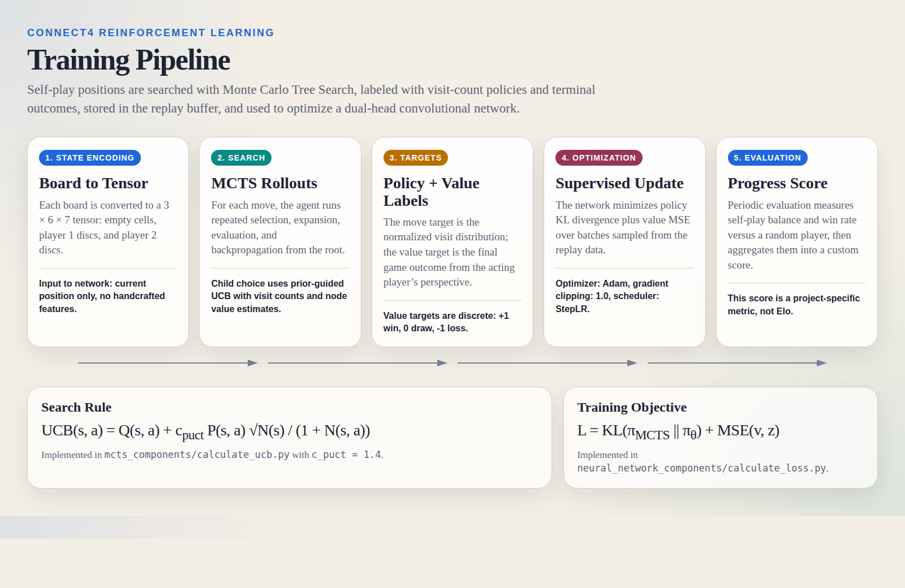
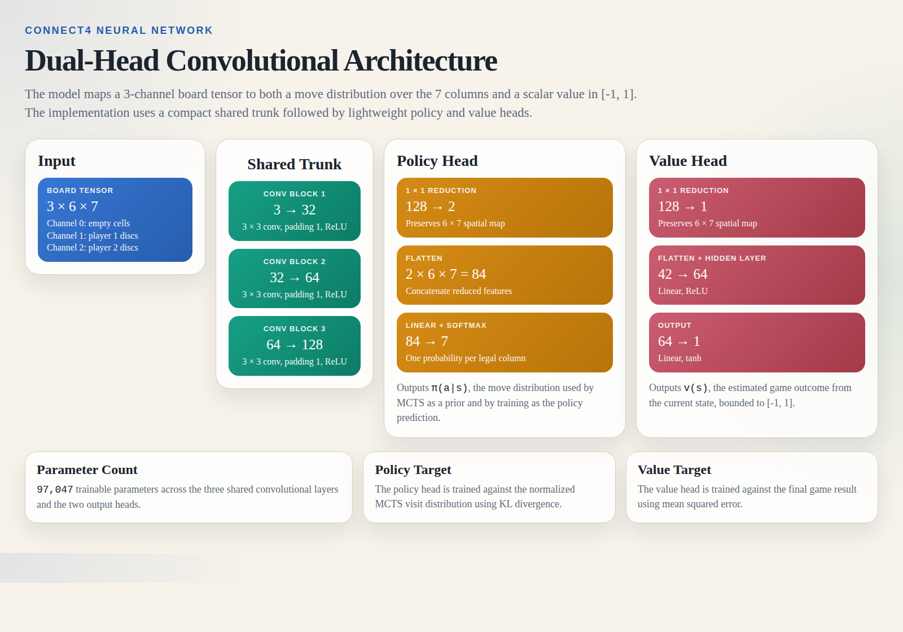

# Connect4 RL

A compact AlphaZero-style Connect 4 project built around self-play, Monte Carlo Tree Search (MCTS), and a dual-head convolutional neural network. The codebase trains a policy-value model from games it generates against itself, then evaluates progress with a lightweight project-specific score.

## Overview

The repository is organized around five subsystems:

1. `game_engine_components/` implements board state management, move application, terminal detection, and tensor conversion.
2. `neural_network_components/` implements the shared convolutional trunk, the policy head, the value head, and the training loss.
3. `mcts_components/` implements tree node creation, selection, expansion, evaluation, and value backpropagation.
4. `training_data_components/` generates self-play games and converts them into policy/value supervision.
5. `training_loop_components/` runs iterative training, evaluation, checkpointing, and scheduler updates.

## System Architecture



### Self-Play Loop

For each position, the agent runs MCTS, converts the visit counts at the root into a target move distribution, samples a move, and appends the position to the training set. When the game terminates, each stored position receives the final game outcome from the perspective of the player who acted in that state.

If the terminal game result is denoted by \(z \in \{-1, 0, 1\}\), then the stored value target for a position played by player \(p\) is:

$$
v_{\text{target}} =
\begin{cases}
z & \text{if } p = \text{player 1} \\
-z & \text{if } p = \text{player 2}
\end{cases}
$$

This matches the implementation in `training_data_components/assign_game_outcomes.py`.

## Neural Network



The model in `neural_network_components/neural_network.py` contains a shared convolutional trunk followed by separate policy and value heads.

### Input Encoding

Each board is represented as a 3-channel tensor of shape \(3 \times 6 \times 7\):

- Channel 0: empty cells
- Channel 1: player 1 discs
- Channel 2: player 2 discs

This encoding is produced in `game_engine_components/get_state_tensor.py`.

### Shared Trunk

The shared feature extractor in `neural_network_components/shared_feature.py` is:

$$
\text{Conv}(3 \rightarrow 32, 3 \times 3) \rightarrow \text{ReLU}
$$

$$
\text{Conv}(32 \rightarrow 64, 3 \times 3) \rightarrow \text{ReLU}
$$

$$
\text{Conv}(64 \rightarrow 128, 3 \times 3) \rightarrow \text{ReLU}
$$

All convolutions use padding \(= 1\), so the spatial resolution remains \(6 \times 7\) throughout the trunk.

### Policy Head

The policy head in `neural_network_components/policy_head.py` is:

$$
\text{Conv}_{1 \times 1}(128 \rightarrow 2)
\rightarrow \text{Flatten}(2 \times 6 \times 7 = 84)
\rightarrow \text{Linear}(84 \rightarrow 7)
\rightarrow \text{Softmax}
$$

It outputs a distribution over the 7 legal columns:

$$
\pi_\theta(a \mid s) \in \mathbb{R}^7
$$

### Value Head

The value head in `neural_network_components/value_head.py` is:

$$
\text{Conv}_{1 \times 1}(128 \rightarrow 1)
\rightarrow \text{Flatten}(1 \times 6 \times 7 = 42)
\rightarrow \text{Linear}(42 \rightarrow 64)
\rightarrow \text{ReLU}
\rightarrow \text{Linear}(64 \rightarrow 1)
\rightarrow \tanh
$$

It outputs a scalar bounded to:

$$
v_\theta(s) \in [-1, 1]
$$

where \(+1\) indicates a position the model believes is winning for the current player, \(0\) is balanced or drawn, and \(-1\) is losing.

### Parameter Count

The current architecture has **97,047 trainable parameters**.

## MCTS

During search, child selection uses the prior-guided UCB rule implemented in `mcts_components/calculate_ucb.py`:

$$
\text{UCB}(s, a) = Q(s, a) + c_{\text{puct}} \cdot P(s, a) \cdot \frac{\sqrt{N(s)}}{1 + N(s, a)}
$$

where:

- \(Q(s, a)\) is the action value estimate
- \(P(s, a)\) is the policy prior from the network
- \(N(s)\) is the parent visit count
- \(N(s, a)\) is the child visit count
- \(c_{\text{puct}} = 1.4\) in the current implementation

The simulation loop in `mcts_components/run_simulation.py` follows the standard pattern:

1. Selection
2. Expansion
3. Neural network evaluation
4. Value backpropagation

## Training Objective

The loss in `neural_network_components/calculate_loss.py` combines policy matching and value regression:

$$
\mathcal{L} =
\lambda_\pi \, \mathrm{KL}\left(\pi_{\text{MCTS}} \,\|\, \pi_\theta\right)
+ \lambda_v \, \mathrm{MSE}\left(v_\theta, z\right)
$$

In the current code, both weights default to \(1.0\):

$$
\lambda_\pi = \lambda_v = 1
$$

The optimizer in `main_training_loop.py` is Adam with:

- learning rate: `1e-3`
- weight decay: `1e-4`
- gradient clipping: `1.0`
- scheduler: `StepLR(step_size=100, gamma=0.9)`

## What The Score Means

The README previously referred to a "rating" or "score". In this project, that number is **not an Elo rating** and should not be interpreted as a standardized playing-strength benchmark.

The score is computed in `training_loop_components/evaluate_progress.py` as:

$$
\text{score} =
30 \cdot (1 - \text{win\_rate\_balance})
+ 40 \cdot \text{win\_rate\_vs\_random}
+ 30 \cdot \text{avg\_win\_rate\_vs\_baselines}
$$

with a hard cap at 100.

### Interpretation

- `win_rate_balance` measures how asymmetric self-play outcomes are between player 1 and player 2.
- `win_rate_vs_random` measures how often the agent beats a random opponent.
- `avg_win_rate_vs_baselines` is only used if stronger baseline models are supplied.

Because the default evaluation path in this repository usually compares against a random player and does not provide external baselines, the practical score is often dominated by:

$$
30 \cdot (1 - \text{win\_rate\_balance}) + 40 \cdot \text{win\_rate\_vs\_random}
$$

So if you see a value such as **14.00**, that means the model earned **14 points on this custom 0-100 internal scale**, not "14 Elo" and not "14% win rate" by itself.

## Available Artifacts

The repository currently includes checkpoint artifacts in `checkpoints/`, including saved models through iteration 500. The architecture documented above matches the checkpoint metadata path used by `training_loop_components/save_checkpoint.py`.

## Latest Checkpoint Snapshot

The latest screencast has been copied into this repo at `assets/screencasts/checkpoint_0500_latest_screencast_2026-05-18.webm`. It is based on the last checkpoint: `checkpoints/checkpoint_iter_0500_20250712_162910.pt`.

On `2026-05-18`, that checkpoint was benchmarked with `scripts/benchmark_checkpoint.py` and the result was saved to `benchmarks/checkpoint_iter_0500_20250712_162910.json`.

- internal score: **2.0 / 100**
- self-play sample: `20` games at `24` MCTS simulations per move
- self-play outcomes: `20` player-1 wins, `0` player-2 wins, `0` draws
- vs random: `1` win, `19` losses, `0` draws

This is still **not Elo**. It is the repository's current internal benchmark for the last checkpoint, and the score is bad right now. The agent is still a lil bit dumb in its current form.

I have dwelved deeper into these models since this checkpoint, and I am going to improve the model and update this repository soon.

## Self-Play GUI

The repository now includes a local viewer:

```bash
python self_play_gui.py --checkpoint checkpoints/checkpoint_iter_0500_20250712_162910.pt
```

The GUI:

- loads a trained checkpoint
- runs model-vs-model self-play using the existing MCTS implementation
- animates moves on a Connect 4 board
- shows the current value estimate
- shows root visit counts for each column
- logs move-by-move search summaries

If no checkpoint is passed, it attempts to load the newest file in `checkpoints/`.

## References

- [Mastering Chess and Shogi by Self-Play with a General Reinforcement Learning Algorithm](https://arxiv.org/abs/1712.01815)
- [A General Reinforcement Learning Algorithm that Masters Chess, Shogi, and Go through Self-Play](https://www.science.org/doi/10.1126/science.aar6404)
